# Add Classes to Your Diagram

Classes in a UML diagram are depicted as a block with the class name at the top and sections for fields, constructors, and methods below. This page will teach you how to create class blocks that look like this in draw.io:

   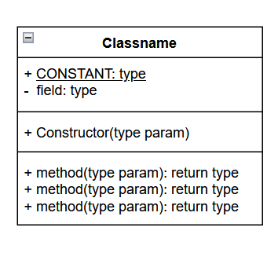

## Add UML Shapes to Shapes Panel

The Shapes panel on the left-hand side of the screen on Draw.io has many pre-made shape templates for different kinds of diagrams, but most of them are not visible initially.

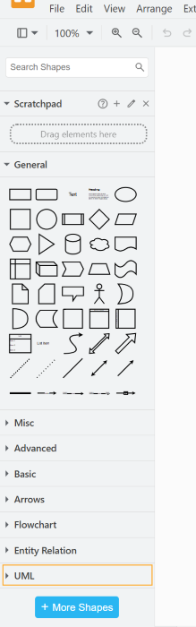

If you do not see a _UML_ section in your Shapes panel, here is how to add it.

1. **Click** [ + More Shapes ].

    This will open the Shapes selection box.
    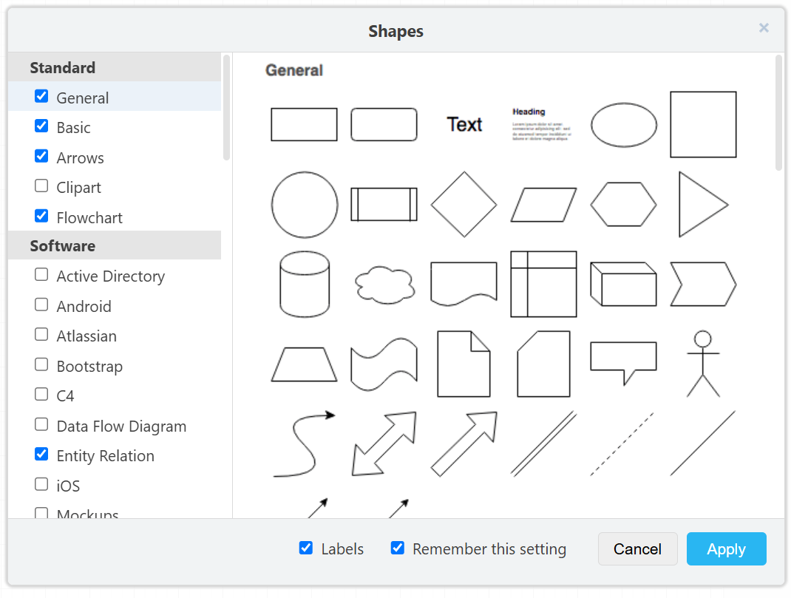

2. **Click** the _UML_ shape set in the left-hand side of the Shapes selection box to preview the shape set.
    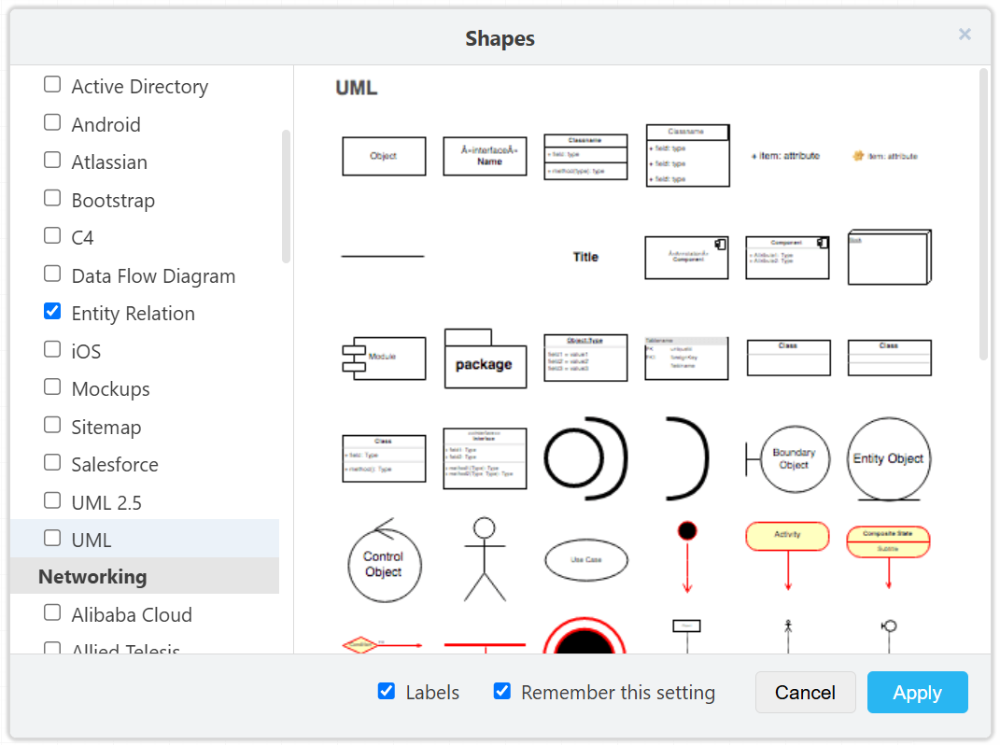

3. **Select** the checkbox beside _UML_ to add the set to your shapes.

    

4. **Select** the _Labels_ checkbox to add name labels for each shape in the shape panel.

    

    !!! note

         **Select** the "Remember This Setting" checkbox as well to have your selected shape set already visible the next time you visit draw.io with this browser.

5. **Click** [ Apply ].

    You should now see the UML shape set in the Shapes panel.

6. **Click** the _UML_ heading to expand the shape set.

    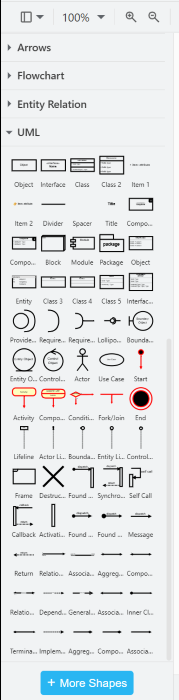

## Create a Class Block
Class Block are the fundamental component of UML class diagrams. This section will teach you how to create a class block with four sections: A class header with the class name, a fields block, a constructor block, and a methods block. draw.io doesn't have a prebuilt template that includes a constructor block, so we will add one later in this section. 

1. **Click and Drag** the shape labeled _Class_ from the UML section of the Shapes panel to the central canvas.

    

    !!! note

         To create a block for an interface, use the shape labelled _Interface 2_

         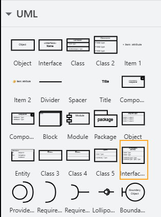

2. **Double Click** the _Classname_ text in the class header to rename your class.

    

3. _Optional_ **Select** your class name text and **Click** [ I ] in the Text tab in the right-hand Format panel to mark your class as an abstract class.

    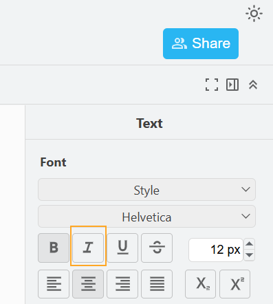

    !!! warning

         If you delete all text from a text box below the header, the block containing it will shrink when you click out and become inaccessible.

          
      
         See [Troubleshooting](troubleshooting.md) for how to handle this issue.

4. **Double Click** the text box below the class header to enter class level constants and instance variables

    !!! note

         In a UML Class diagram, a class member is marked as static with an underline, and the symbol before a class member marks its visibility

            +  means public
            -  means private
            #  means protected

    !!! warning

         Text boxes will not automatically grow as you add additional lines of text, and any overflowing text will be hidden. 
         
         To expand the text box:
 
         1. **Click** outside the class block to exit text entry mode
 
         2. **Click** the text box to reselect it.
 
         3. **Click and Drag** the blue dot in the centre of the bottom edge to expand the box.
 
         

5. **Right Click** the methods block to open the context menu.

6. **Click** [ Duplicate ] to create a copy that will serve as the constructor block.

    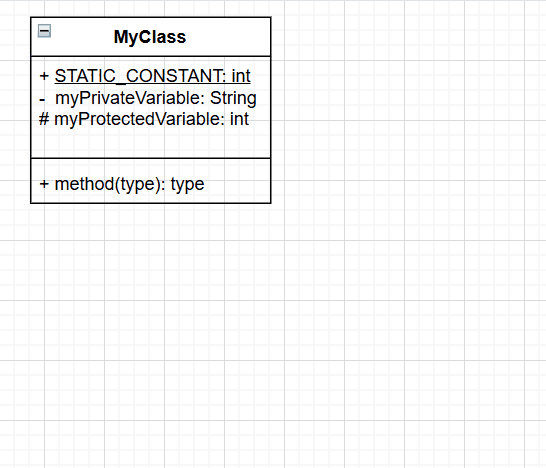

7. **Click and Drag** a new divider from the Shapes panel and **Insert** it between the two copies of the method block.

    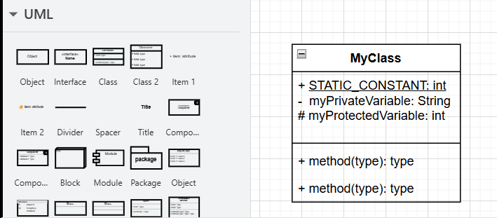

8. **Double Click** top copy of the method block to edit the text to reflect the class's constructor(s).

8. **Double Click** bottom copy of the methods block to edit the text to reflect the class's methods(s).

9. *Optional:* **Right Click** --> [ Duplicate ] the entire class block and edit the copy to save time when making additional classes. 

    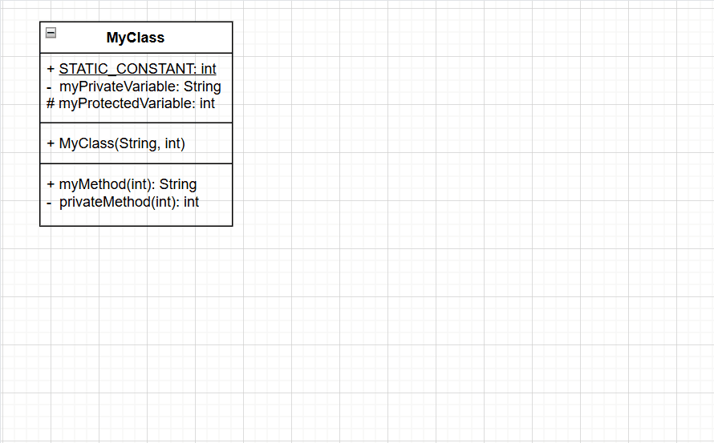

## Arrange Class Blocks

Once you have created a number of class blocks, you will need to arrange them in a layout that makes sense for your UML diagram.

1. **Click and Drag** the class header to move a class block.

2. **Click** the canvas and **Drag** out a selection rectangle to select multiple shapes to move them as a unit.

    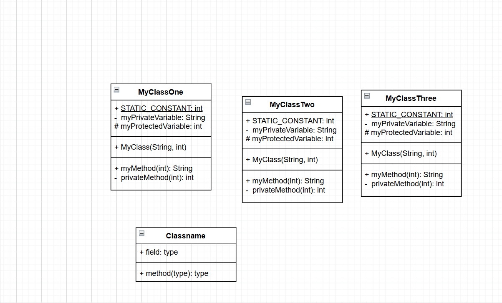

    !!! note

         Only shapes/text fully within the selection rectangle will be selected. Zoom out to be able to select more items.

3. *Optional:* **Select** multiple items --> **Select** _Arrange_ in the Format panel --> **Click** [ Group ] to have the selected items move as a unit permanently.

    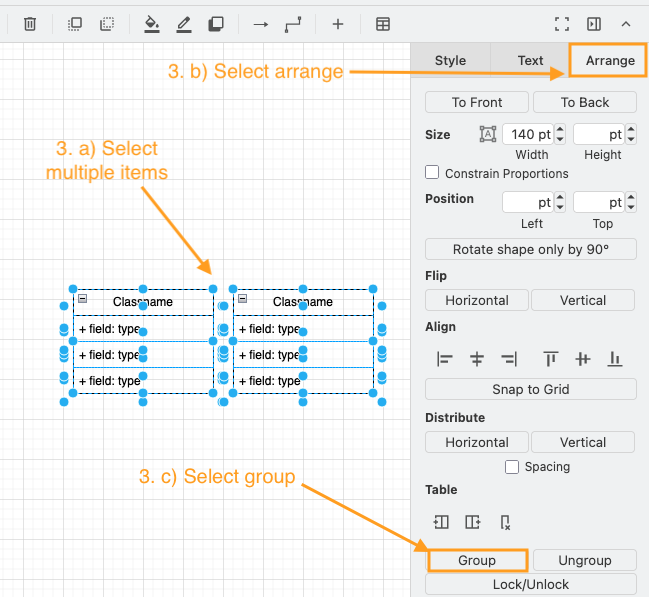

    !!! note

         The [ Group] button will change to [ Ungroup ] once the items are grouped. **Click** [ Ungroup ] when you want to move them separately in the future.

    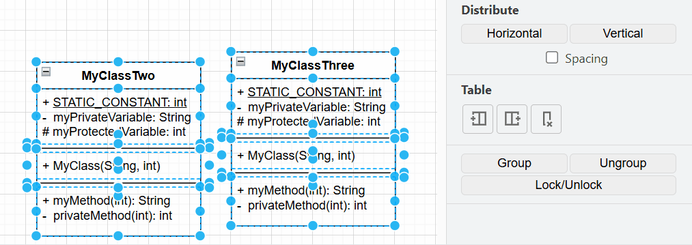

15. *Optional:* **Select** multiple items and **Click** one of the Align buttons in the Arrange tab to align the items vertically or horizontally. 

    !!! warning
         Aligning items vertically when they are in a horizontal row, or aligning them horizontally when they are in a vertical column, will stack them on top of each other.

    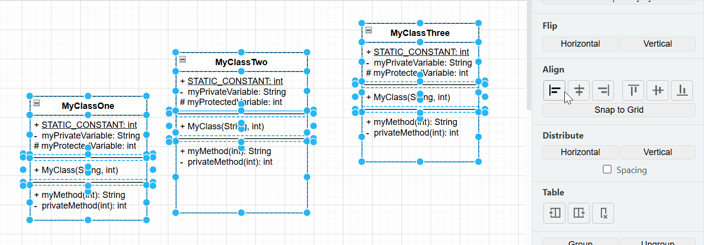

When you are satisfied with all your class blocks, it is time to [add connectors to specify their relationships](connectors.md).