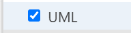
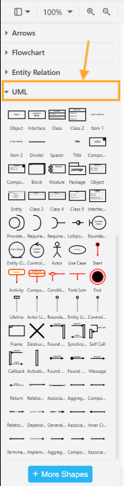

# Add Classes to Your Diagram

Classes in a UML diagram are depicted as a block with the class name at the top and sections for fields, constructors, and methods below. This page will teach you how to create class blocks that look like this in draw.io:

## Add UML Shapes to Shapes Panel

The Shapes panel on the left-hand side of the screen on Draw.io has many pre-made shape templates for different kinds of diagrams, but most of them are not visible initially.

If you do not see a UML section in your Shapes panel, here is how to add it.

1. **Click** [+ More Shapes].

   This will open the Shapes selection box.

   

2. **Click** the "UML" shape set in the left-hand side of the Shapes selection box to preview the shape set.

3. **Select** the checkbox beside "UML" to add the set to your shapes.

4. **Select** the "Labels" checkbox to add name labels for each shape in the shape panel.

!!! note

    **Select** the "Remember This Setting" checkbox as well to have your selected shape set already visible the next time you visit draw.io with this browser.

5. **Click** [Apply].

   You should now see the UML shape set in the Shapes panel.

6. **Click** the UML heading to expand the shape set.

## Create a Class Block

## Arrange Class Blocks

## Change Colours
