# Add Connectors Between Your Class Blocks

Once you have created all the class blocks for your diagram, the next step is to add arrows and other connectors to denote the relationships between classes. There are two ways to add those connectors in draw.io, you can either create a new connector starting from one class block and customize it to the style you need to mark a particular relationship, or you can use the prebuilt connectors from the _UML_ section of the Shapes panel. Since it's sometimes easier to manage the connection points with custom arrows, this page will start by teaching you how to make custom connectors, and then briefly touch on using the prebuilt connectors.

## Using Custom Connectors

1. **Select** connection as the default line type from top bar, if it is not already.

    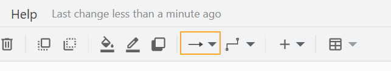

2. **Select** your preferred default line shape from top bar. 

    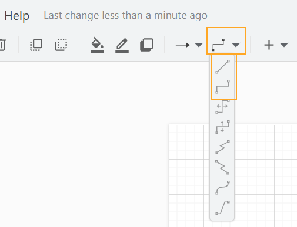

    !!! note

        For a UML Class diagram, you are most likely to want bent lines (which draw.io calls "Waypoints") or straight lines. The shape of any line can be changed later.

3. **Hover** over the class block you want to start from to see its connection points.

    !!! note

        While the block is selected, you can only see the large arrows. These arrows will create connections with the middle of the side of the class block that will automatically switch sides if you later move the connector around. **Deselect** the class block to see all the available connection points. The x's along the block edge will create more specific connections that will stay in place unless you move them. 

    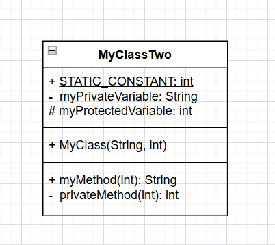

4. **Click** a connection point and **Drag** a connector to the class block you want to point to. **Hover** over a second class and **Release your Drag** when the connection point you want is highlighted.

    !!! note 

        The green line highlight allows connection to any point, while the blue line highlight connects to a point along a side, but will automatically switch sides of the block as you move things around.

    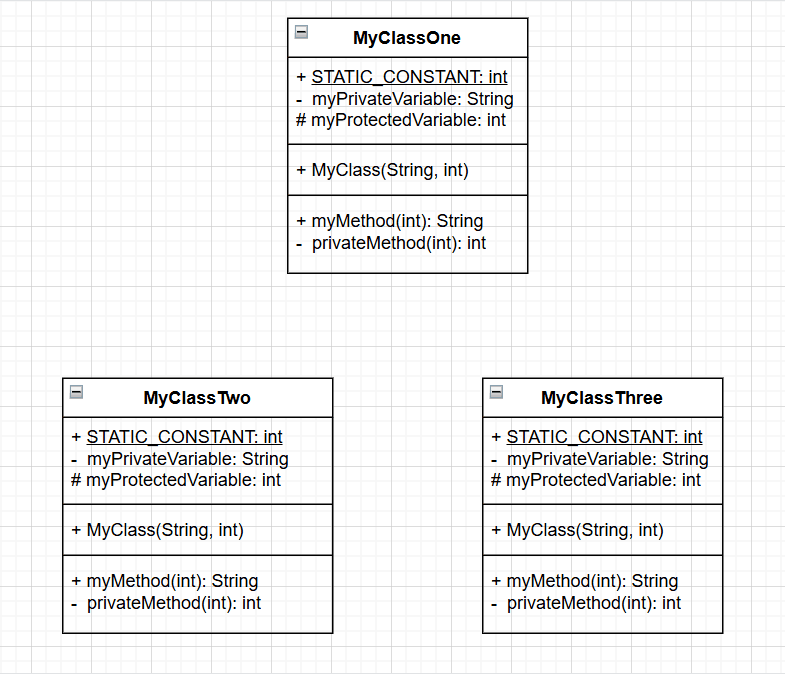

### Editing Connectors
The connector lines can be arranged to suit your diagram, and text labels can be added to more specifically mark to a relationship.

1. **Click** on a connector line to select it.

2. **Click and Drag** line segments to arrange the line into the desired shape. A line segment will only move parallel to its direction. Lining up parallel segments will automatically remove bends, while moving end or connected block can add bends.

    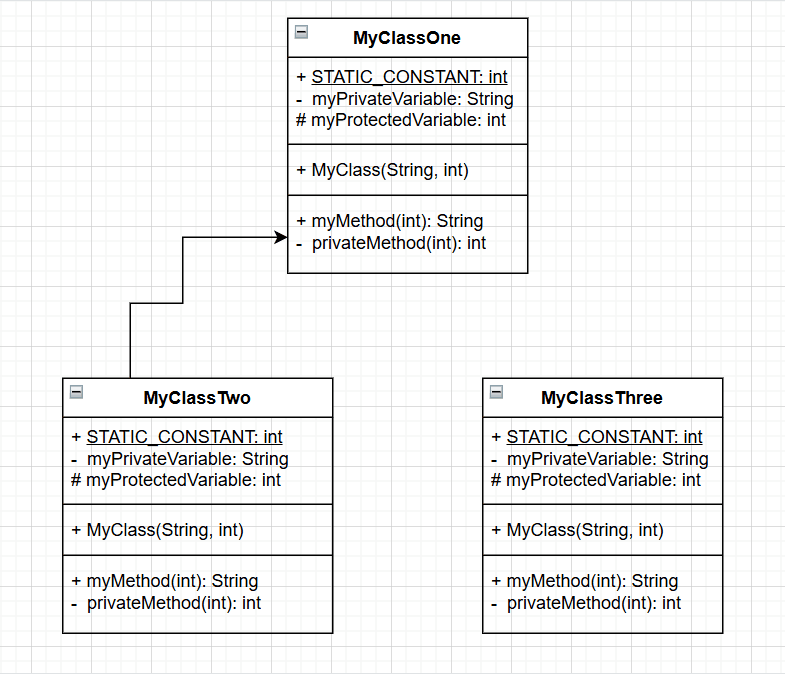

3. *Optional:* **Double Click** a line to add attached text. **Click** the canvas to deselect when you are finished typing.

    !!! warning
        Text added this way will be bound to the line and move with it, even if you move it away. 
        
        More importantly, if you duplicate text attached to a connector via **Right Click** --> [ Duplicate ], the duplicate also remains bound to that connector even if you move it away. Use **Right Click** --> [ Copy ] and **Right Click** --> [ Paste Here ] to avoid this. 
        
        See [troubleshooting](troubleshooting.md) for how to handle if things move unexpectedly when you move other things.

5. *Optional:* **Click and Drag** the text box to move it for readability, or use the arrow keys on you keyboard for fine maneuvering.

    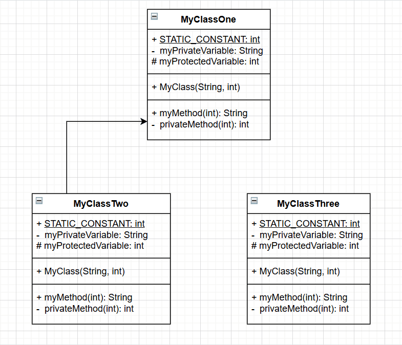

### Adjust Connector Atttributes

Once you have created a connector you can adjust its appearance **in the Style tab of Format panel** to create any of the arrow styles used to denote different relationships in UML diagrams.

1. With a connector selected, **Click** the [ Pattern ] drop-down selector 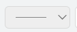 to change the solid line to a dashed line.

    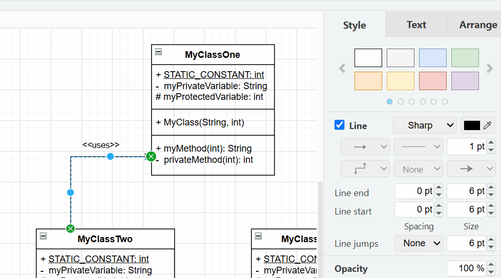

2. With a connector selected, **Click** the [ Line Start ] drop-down selector 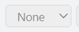 to change the line head shape.

3. With a connector selected, **Click** the [ Line End ] drop-down selector 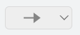 to change the line end shape.

    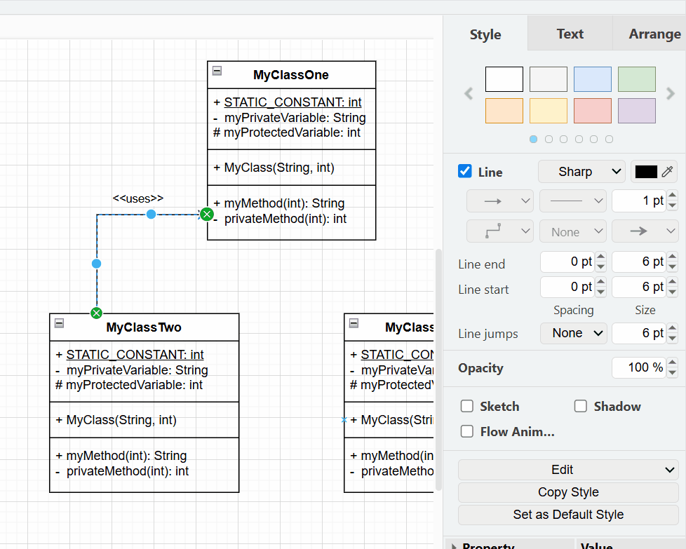

4.  **Increase or Decrease** the px number in the right-hand _Line Start_ or _Line End_ number input to adjust the line start/end shape size.

    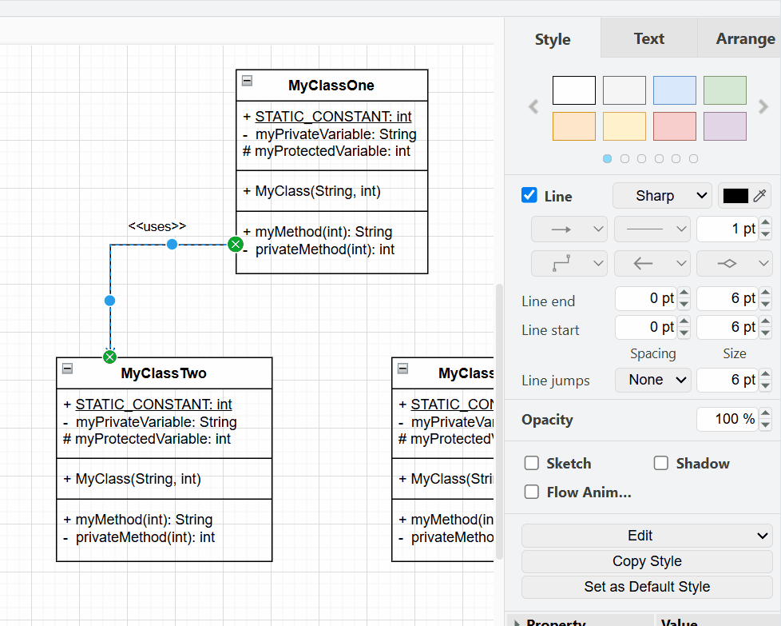

## Using Prebuilt Connectors

For the more complicated connector styles, it may be easier to use the prebuilt connectors.

1. **Click and Drag** the desired connector from the _UML_ section of the Shapes panel to the canvas.

2. **Connect** each end of the connector to the desired block as in steps 4 of the instructions for using custom connectors.

    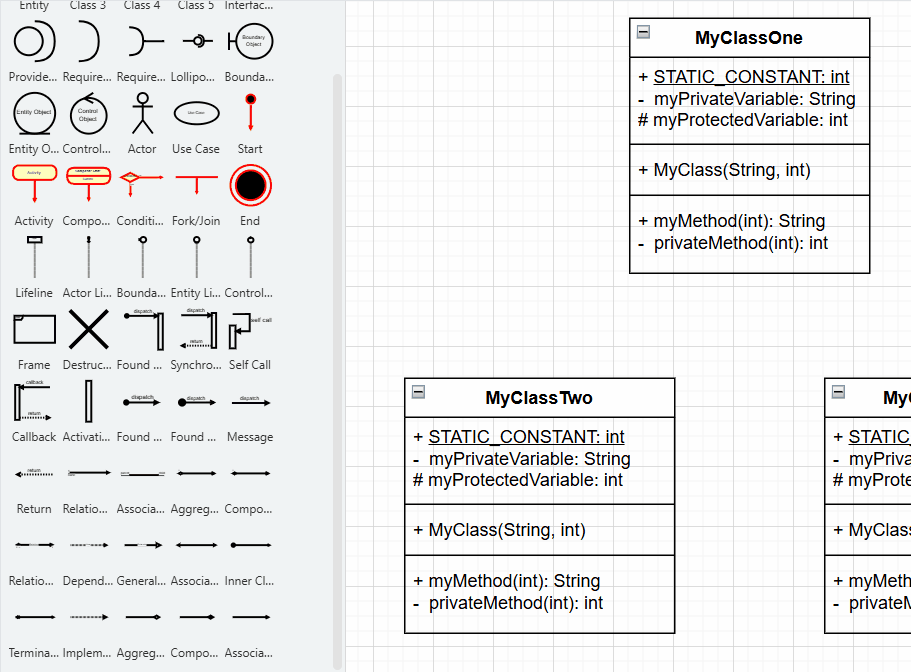

3. Continue with the custom instructions for arranging arrows.

When you have added all your connectors, you can [export your completed diagram](export.md).