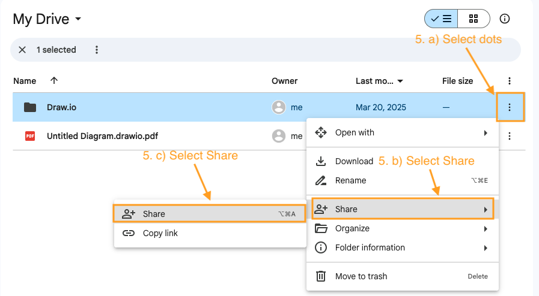
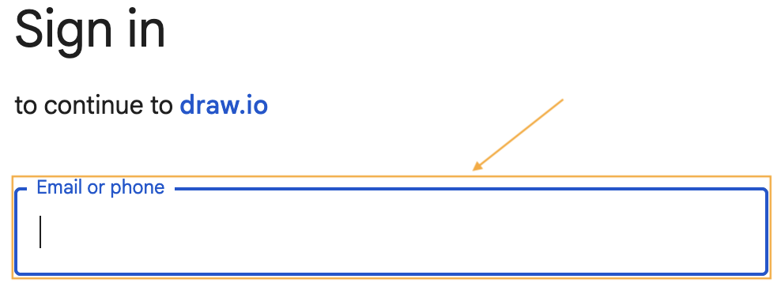
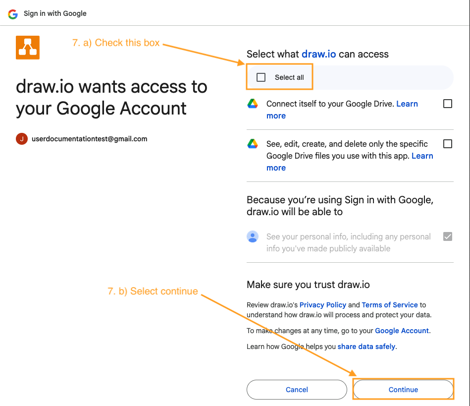
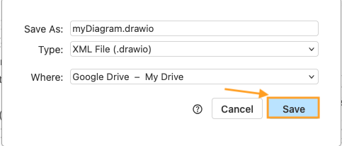

# Create and Share a draw.io File using Google Drive

Drawing diagrams using draw.io allows people to work on a diagram at the same as a team member. This tool also allows people to specify where they'd like to store their diagrams, online or locally. For the purposes of this tutorial, we will cover how to share a diagram created in draw.io and share it over Google Drive.

## Setup Storage Folder in Google Drive

If you want to specify a specific folder in Google Drive for the diagram, you'll need to create that first to be able to save it there.

!!!warning

    If you create the diagram first, then try to share it, you will not be able to specify a specific folder to store the diagram within draw.io,

1. **Go** to [Google Drive](http://drive.google.com).

2. In the top left corner, **Select** [ + New ] -> [ New Folder ].
   
   

3. Name the new folder.
   

4. **Select** [ Create ].
   

5. _Optional_: If you want to share a folder as opposed to a single file, you can find the folder you created and **Select** the three vertical dots icon --> **Select** [ Share ] --> **Select** [ Share ].
   

6. _Optional_: Enter the email address of the person or group you want to share the folder with.
   

7. _Optional_: **Select** [ Done ].
   

## Connect your Google account to Draw.io
After creating the folder you want to store the diagram, you will start connecting your Google account.

1. Go to [draw.io](https://app.diagrams.net/).

2.  You will receive a pop up to prompt you to select a storage place for your diagrams. Under _Save Diagrams To_, **Select** [ Google Drive ].

    

3.  The pop up will change to _Authorization Required._ Under _Authorize this app in Google Drive_, **Select** [ Authorize ].
    

    !!! note
        If you want this Google Drive account to be default storage place for your diagrams, **Select** [ Remember Me ]. You can always change these in your _Settings_ later.

4. You will be asked to choose a Google account to connect to draw.io. **Select** your email from the suggested list or [ Use another account ].
   

5. You will be asked to sign in to your Google Drive account and allow it to connect to Draw.io. Under Sign in to continue to draw.io, **Enter** your email address and password if needed. If you already have your username and password saved in a password mananger, then it will automatically be entered.
   

6. You will be prompted to authorize Google share your name and email to to draw.io. In the bottom right of this window, **Select** [ Continue ].
   

7. You will be asked to select if draw.io can access your Google Drive including the ability to view and modify your Google Drive files used with draw.io. **Check** the [ Select all ] checkbox --> **Select** [ Continue ].
   
    

## Create a New Diagram

Now that your Google account has been connected, you'll return to the draw.io window. You will start with creating a diagram before you will be able to share it.

1. **Select** [ Create New Diagram ].
   

2. Enter the name of the diagram in the bar beside Diagram Name.
   

3. **Select** [ Blank Diagram ] --> [ Create ].
   

4. **Select** [ Save ].

      

## Share with Google Drive for Collaboration

Sharing diagrams through Google Drive allows you to work on a diagram at the same time as those you have shared it with. 

1. In the top right corner, **Select** [ Share ].
   

    !!!note
        If you do not see a share button in the top right corner, you may have the _Simple_ (or _Automatic_) Theme as shown in Step 2. We recommend switching to the _Classic_ theme as it has more options listed in the toolbar. It will help you follow along this tutorial if your theme is the same as the one we display. If this doesn't apply to you, you can move on to Step 3.

2. _Optional:_ In the top right corner, **Select** [ . . . ] --> [ Settings ] --> [ Theme ] --> [ Classic ].
   

3. You will receive a notification that sharing is only available through Google Drive. **Select** [ Open ] and you will be redirected to your Google Drive account.
   

4. Next to the diagram we want to share, **Select** the three vertical dots --> **Select** [ Share ] --> **Select** [ Share ] again.
   

5. Under _Share (Your File Name)_, **Enter** the email address of the person or group you want to share the file with.

    

6. Below _General access_ you can set the privacy options of the file. **Select** one of the following options:

    - [ Restricted ] for only the specific email addresses that the file is shared to
    - [ Anyone with the link ] for allowing access those who receive the link

    

7. On the right side of the window, there is a drop down menu that allows you to select the contributor permissions. **Select** one of the following options:

    - [ Editor ] allows making changes to the diagram
    - [ Viewer ] only permits viewing and not commenting or editing
    - [ Commenter ] allows viewing and commenting

    

8. _Optional:_ The checkbox for _Notify people_ is automatically selected. This sends an email to the email address specified earlier to share with. It's helpful so that you do not need to manually message the specified person.

9. **Select** [ Send ].

      
