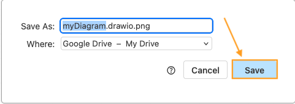

# Export Your Diagram

Once your diagram is complete, you can export it as an image or a PDF.

1. **Select** [ File ] --> [ Export As ] --> [ PNG ] or [ PDF ].

    

3. **Select** the desired destination.

    

4. **Select** [ Export ].

    

5. **Click** [ Save ].

    

After exporting your diagram, you gain a copy of your diagram that can easily be opened with any image software or pdf reader.